# Themes

RoadMark ships with 11 built-in themes. Pass `--style <name>` to the build command to use one:

```bash
roadmark build my-roadmap.md --style polished
```

---

## Light themes

### default

Clean and neutral. Color-coded column badges (green / blue / grey) on a light grey canvas.

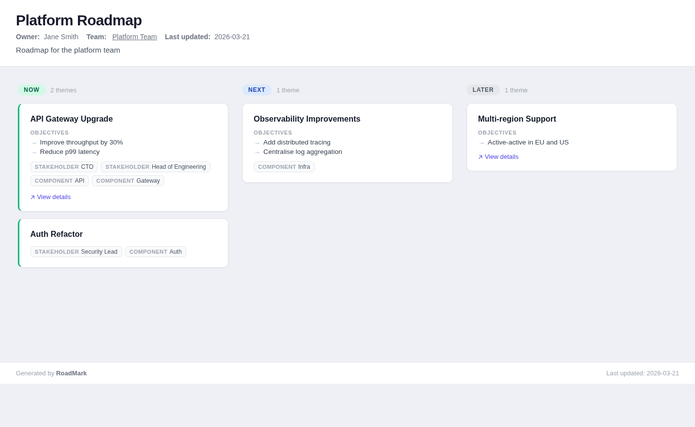

---

### minimal

Typography-first. No card borders or shadows — just clean whitespace and restrained color.

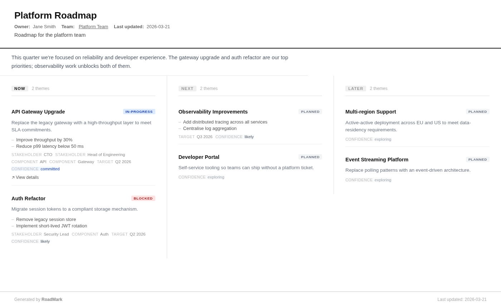

---

### polished

Refined and professional, with strong column dividers and crisp sans-serif type.

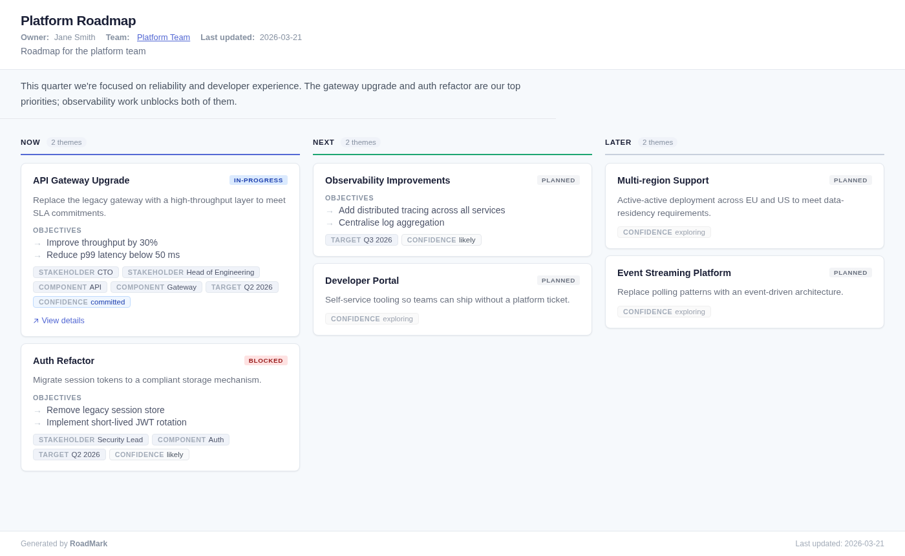

---

### enterprise

Conservative and corporate-safe. Muted palette, tight spacing, dense information layout.

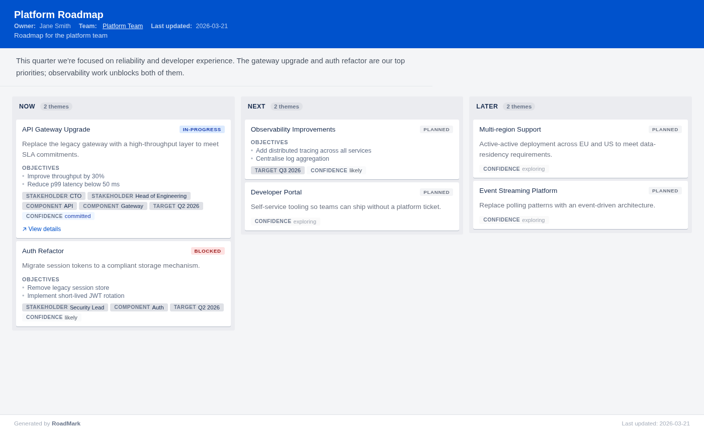

---

### pastel

Soft pastel backgrounds with gentle tones — approachable and easy on the eye.

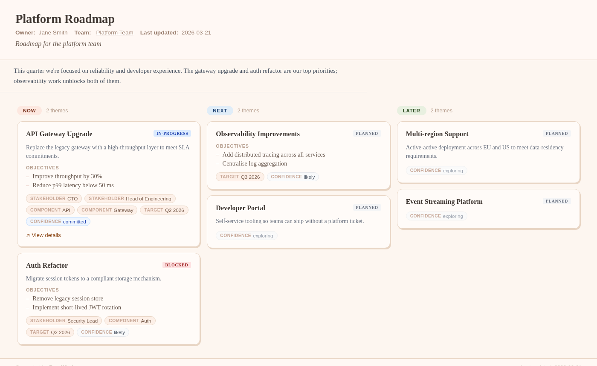

---

### tricolor

Each column has its own background colour: green for Now, blue for Next, amber for Later.

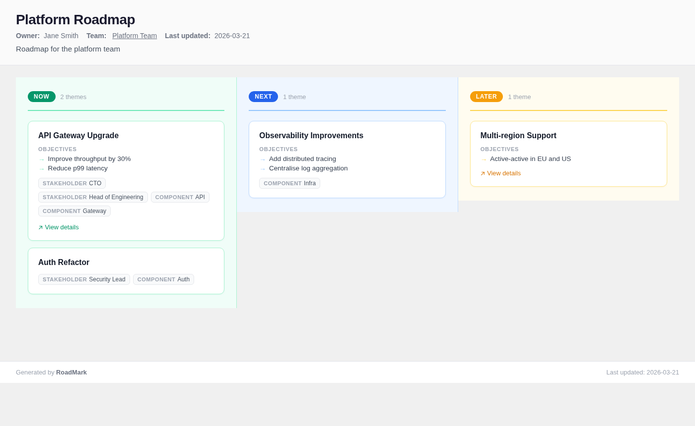

---

## Dark themes

### bold

High contrast dark background with vivid accent colors and prominent card borders.

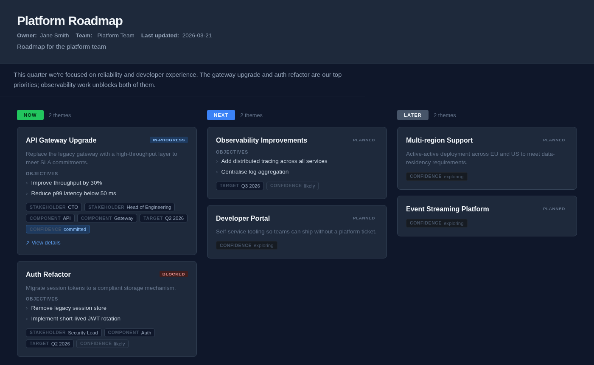

---

### terminal

Monospace font, dim green accents, and a dark background for a command-line aesthetic.

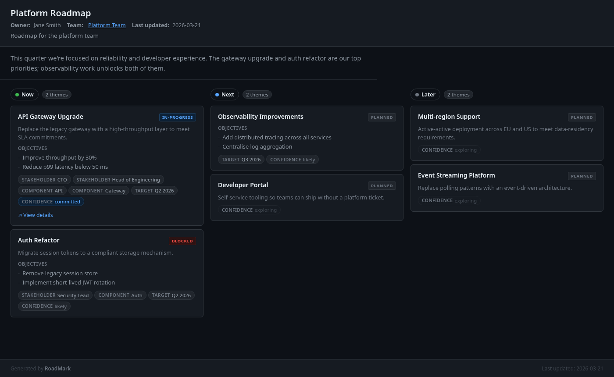

---

## Sci-fi themes

### lcars

Star Trek LCARS panel interface. Black background with orange, violet, and mauve column colour-coding. Rounded-left column headers and thick coloured card borders.

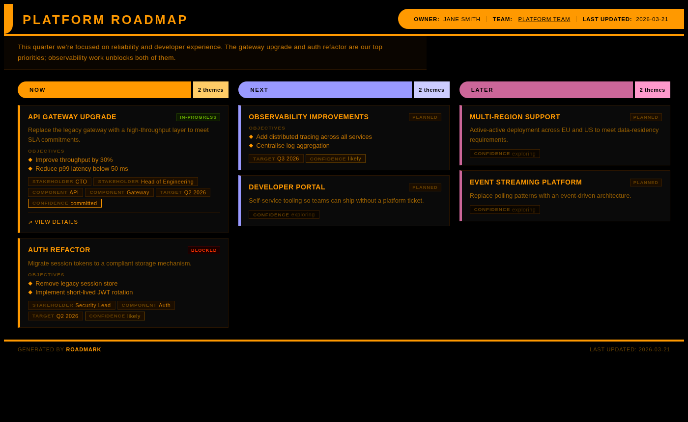

---

### dradis

Battlestar Galactica CIC tactical display. Near-black background, amber phosphor palette, hard edges, monospace type, and military-style `//` delimiters and `[count]` notation.

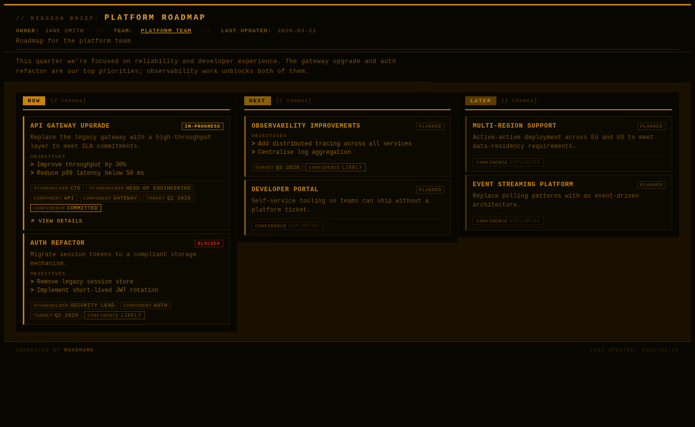

---

### matrix

The Matrix. Pure black with a subtle scanline texture, phosphor green throughout, title glow, and a blinking cursor on empty columns.

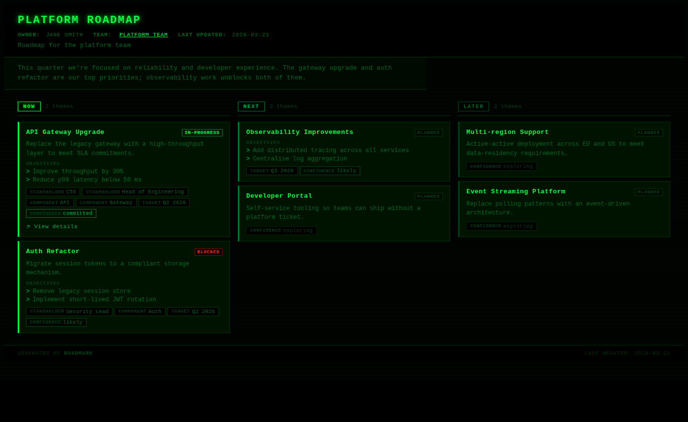
